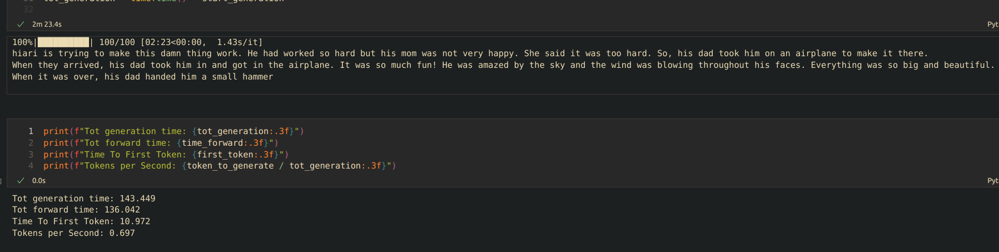

# gnomodel
(WIP) llama2 scratch ttnn implementation to be trained with TinyStories. Goal: having a little gnome telling about stories on Tenstorrent e75 accelerator :-)

Is working pretty slow atm, it needs some optimization... But it's pretty funny!

